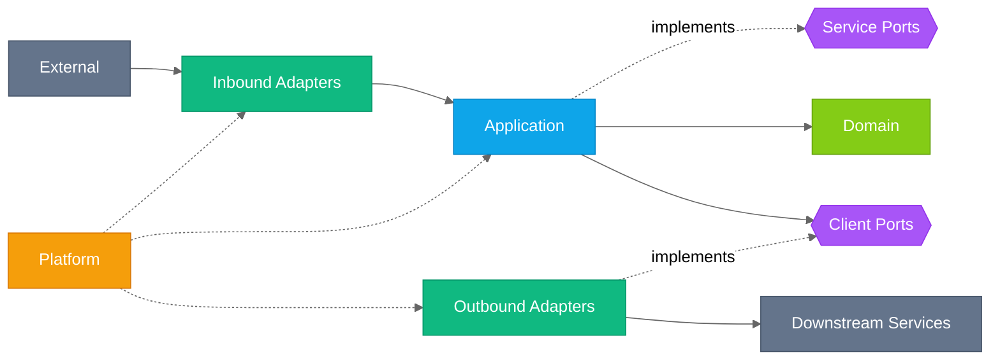

# Go Service Template

[](https://github.com/jsamuelsen/go-service-template/actions/workflows/ci.yaml)
[](https://raw.githubusercontent.com/jsamuelsen/go-service-template/octocov/report.json)
[](https://go.dev/)

Enterprise-grade Go backend service template implementing Clean/Hexagonal Architecture.

## Architecture

This template implements **Hexagonal Architecture** (Ports and Adapters), isolating business
logic from infrastructure concerns. Dependencies flow inward toward the domain layer.



For detailed architecture documentation, see [docs/ARCHITECTURE.md](docs/ARCHITECTURE.md).

## Installation

### Prerequisites

**Go 1.25.7+** (via [Mise](https://mise.jdx.dev/)):

```bash
# Install Mise (if not already installed)
curl https://mise.run | sh

# Install Go
mise use go@1.25.7
```

**Task** (build automation):

```bash
brew install go-task
```

**Docker** (optional, for containerized runs)

### Setup

```bash
git clone https://github.com/jsamuelsen/go-service-template.git
cd go-service-template
task setup
```

This installs Go dependencies, development tools, and Git hooks.

## Run Locally

```bash
task run
```

This starts the service with hot reload (via [air](https://github.com/air-verse/air)). The service runs on `http://localhost:8080`.

Verify it's running:

```bash
curl http://localhost:8080/-/live
```

## Task Commands

> **Tip:** Run `task` with no arguments to see all available commands with descriptions.

### Setup & Development

```bash
task setup             # Install all development dependencies
task run               # Run the service locally with hot reload
task generate          # Run go generate (mocks, etc.)
```

### Build

```bash
task build             # Build production binary with version info
task clean             # Clean build artifacts
```

### Code Quality

```bash
task fmt               # Format all Go code (gofumpt)
task lint              # Run golangci-lint
task vuln              # Run govulncheck for vulnerabilities
```

### Testing

```bash
task test              # Run unit tests with race detection
task test:integration  # Run GoDog BDD integration tests
task test:e2e          # Run full E2E test suite
task test:benchmark    # Run Go benchmarks
task test:load         # Run k6 load tests
task coverage          # Generate test coverage report
task coverage:view     # Generate coverage and open in browser
```

### CI/CD

```bash
task ci                # Run full CI pipeline locally (fmt, lint, test, coverage, vuln)
```

### Docker

```bash
task docker:build      # Build Docker image
task docker:run        # Run Docker container locally
```

### OpenAPI

```bash
task openapi:validate   # Validate OpenAPI spec
task openapi:diff       # Check for breaking changes vs main
task openapi:changelog  # Generate changelog vs main
```

## Configuration

The service uses a layered configuration system with profile-based overrides.

### Config Hierarchy (highest to lowest precedence)

1. Environment variables (`APP_` prefix)
2. Profile config (`configs/{profile}.yaml`)
3. Base config (`configs/base.yaml`)
4. Default values

### Available Profiles

| Profile | Description                                                      |
| ------- | ---------------------------------------------------------------- |
| `local` | Local development (debug logging, text format, relaxed timeouts) |
| `dev`   | Development environment                                          |
| `qa`    | QA/staging environment                                           |
| `prod`  | Production (JSON logging, strict settings)                       |
| `test`  | Test environment                                                 |

### Switching Profiles

```bash
# Default is 'local'
task run

# Use a different profile
APP_PROFILE=dev task run
```

### Environment Variable Overrides

Environment variables use underscore separators and the `APP_` prefix:

```bash
# Override server port
APP_SERVER_PORT=9090 task run

# Override log level
APP_LOG_LEVEL=debug task run
```

See `configs/` directory for all available options.

## Health Endpoints

| Endpoint     | Purpose                                               |
| ------------ | ----------------------------------------------------- |
| `/-/live`    | Liveness probe (always 200 if service is running)     |
| `/-/ready`   | Readiness probe (checks all registered health checks) |
| `/-/build`   | Build info (version, git commit, build time)          |
| `/-/metrics` | Prometheus metrics endpoint                           |

## Project Structure

```text
├── cmd/service/       # Application entrypoint
├── internal/
│   ├── domain/        # Business entities, domain errors (no dependencies)
│   ├── ports/         # Interface definitions (contracts)
│   ├── app/           # Application services (use case orchestration)
│   ├── adapters/      # HTTP handlers, middleware, downstream clients
│   └── platform/      # Config, logging, telemetry (cross-cutting)
├── configs/           # Environment-specific configuration files
├── api/               # OpenAPI specification
├── test/
│   ├── integration/   # GoDog BDD integration tests
│   ├── benchmark/     # Go benchmark tests
│   └── load/k6/       # k6 load test scripts
└── docs/              # Documentation
```

## Tests

### Unit Tests

```bash
task test
```

Runs all unit tests with race detection using [gotestsum](https://github.com/gotestyourself/gotestsum).

### Integration Tests

```bash
task test:integration
```

Runs GoDog/Cucumber BDD tests. Requires the service to be running.

### Benchmark Tests

```bash
task test:benchmark
```

Runs Go benchmarks in `test/benchmark/`.

### Load Tests

```bash
task test:load
```

Runs [k6](https://k6.io/) load tests. Requires k6 installed (`task setup` handles this).

### Coverage Report

```bash
task coverage
```

Generates an HTML coverage report at `coverage.html`.

## Documentation

| Document                                     | Description                                            |
| -------------------------------------------- | ------------------------------------------------------ |
| [Contributing](CONTRIBUTING.md)              | Contribution guide, code standards, PR process         |
| [Architecture](docs/ARCHITECTURE.md)         | System design, layer descriptions, middleware pipeline |
| [ADRs](docs/adr/README.md)                   | Architecture Decision Records with context & rationale |
| [Playbook](docs/playbook/README.md)          | Step-by-step how-to guides for common tasks            |
| [Troubleshooting](docs/TROUBLESHOOTING.md)   | Diagnosing and resolving common issues                 |
| [Patterns](docs/PATTERNS.md)                 | Go patterns for concurrency, services, error handling  |
| [Secret Redaction](docs/SECRET_REDACTION.md) | Logging security and secret redaction                  |
