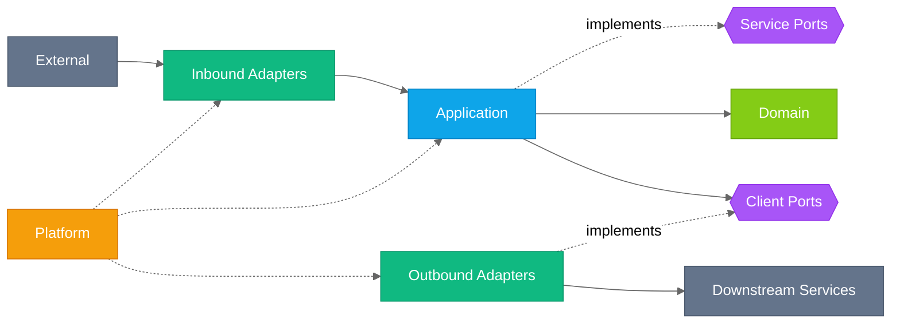
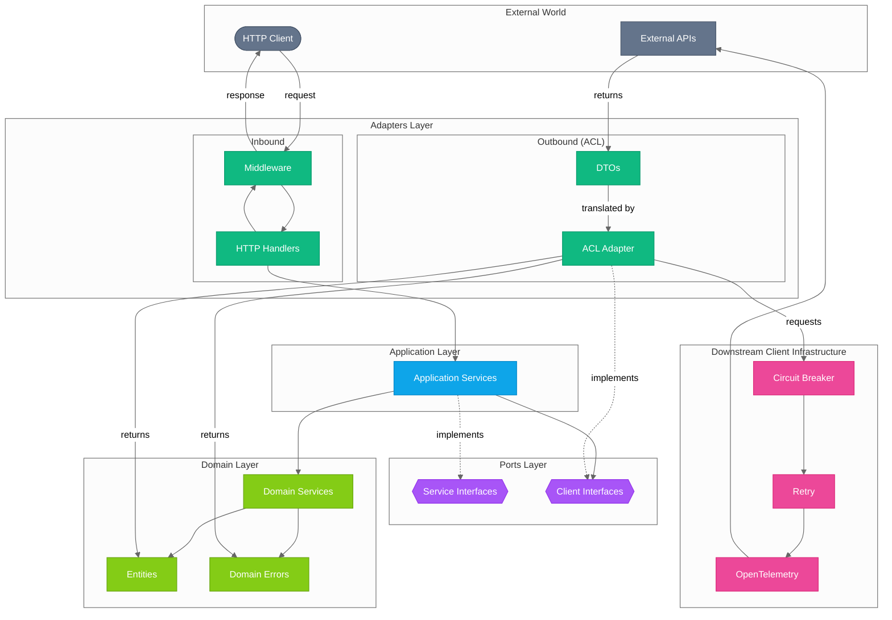
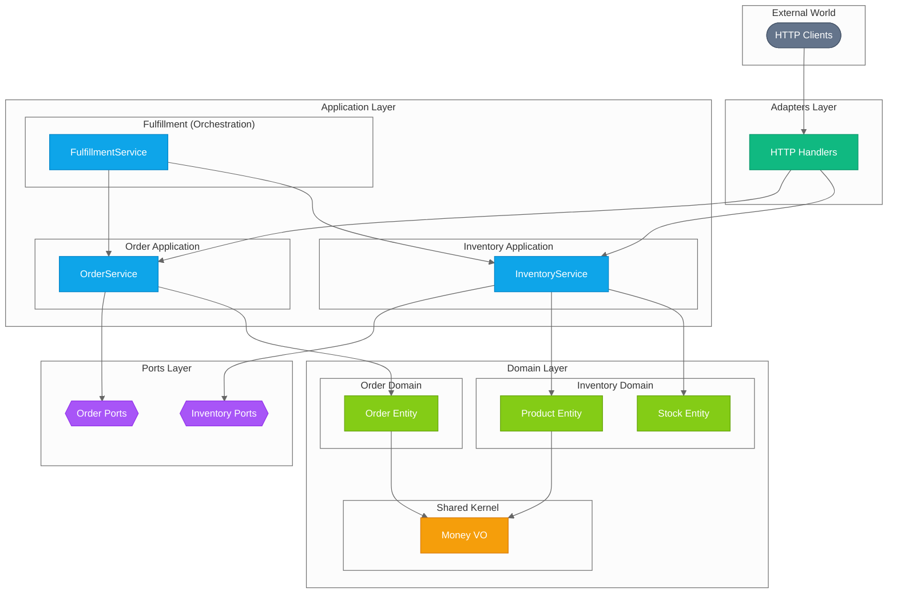
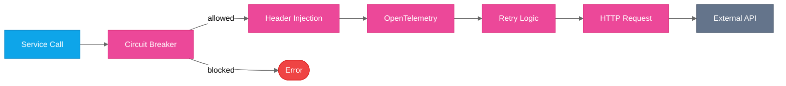
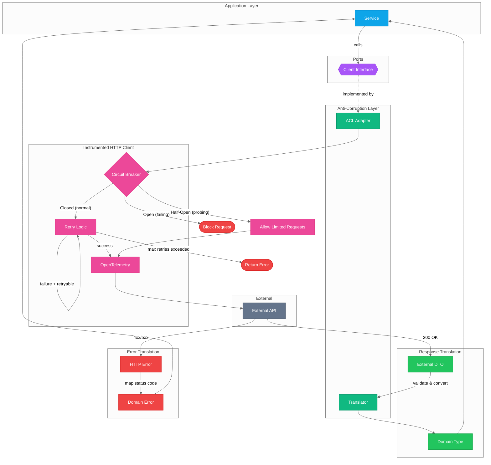

# Architecture

This document describes the architecture of the Go Service Template, which implements Clean/Hexagonal Architecture.

## Table of Contents

- [Architecture](#architecture)
  - [Table of Contents](#table-of-contents)
  - [Introduction](#introduction)
  - [Acronyms \& Glossary](#acronyms--glossary)
  - [Architecture Overview](#architecture-overview)
    - [High-Level Layer Structure](#high-level-layer-structure)
    - [Detailed Component Architecture](#detailed-component-architecture)
    - [Layer Descriptions](#layer-descriptions)
      - [Domain Layer (`/internal/domain/`)](#domain-layer-internaldomain)
      - [Ports Layer (`/internal/ports/`)](#ports-layer-internalports)
      - [Application Layer (`/internal/app/`)](#application-layer-internalapp)
      - [Adapters Layer (`/internal/adapters/`)](#adapters-layer-internaladapters)
      - [Platform Layer (`/internal/platform/`)](#platform-layer-internalplatform)
    - [Scaling to Multiple Domains](#scaling-to-multiple-domains)
    - [Context](#context)
  - [Middleware Pipeline](#middleware-pipeline)
    - [Inbound Middleware (HTTP Server)](#inbound-middleware-http-server)
    - [Outbound Middleware (HTTP Client)](#outbound-middleware-http-client)
  - [Downstream Client Infrastructure](#downstream-client-infrastructure)
    - [Circuit Breaker States](#circuit-breaker-states)
    - [Retry with Exponential Backoff](#retry-with-exponential-backoff)
    - [Error Translation (ACL)](#error-translation-acl)
  - [Observability](#observability)
    - [Distributed Tracing](#distributed-tracing)
    - [Metrics](#metrics)
    - [Structured Logging](#structured-logging)
  - [Dependency Injection](#dependency-injection)
    - [Wiring Flow](#wiring-flow)
    - [Why Manual DI?](#why-manual-di)
  - [Key Design Decisions](#key-design-decisions)
    - [1. Hexagonal Architecture](#1-hexagonal-architecture)
    - [2. Manual DI Over Frameworks](#2-manual-di-over-frameworks)
    - [3. Domain Errors Over Infrastructure Errors](#3-domain-errors-over-infrastructure-errors)
    - [4. Structured Logging with slog](#4-structured-logging-with-slog)
    - [5. OpenTelemetry for Observability](#5-opentelemetry-for-observability)
  - [References](#references)
    - [Internal Documentation](#internal-documentation)
    - [External Resources](#external-resources)

---

## Introduction

This service template implements **Hexagonal Architecture** (also known as Ports and Adapters), a pattern that
isolates the core business logic from external concerns. The key benefits are:

- **Testability**: Core logic can be tested without infrastructure dependencies
- **Flexibility**: Swap implementations (databases, APIs) without changing business logic. Safely evolve data
  entities and structures with changes isolated to specific layers.
- **Maintainability**: Clear boundaries prevent coupling between layers

---

## Acronyms & Glossary

| Acronym  | Full Name             | Description                                                                                                                          |
| -------- | --------------------- | ------------------------------------------------------------------------------------------------------------------------------------ |
| **ACL**  | Anti-Corruption Layer | Pattern that translates between external service formats and domain types, preventing external concepts from leaking into the domain |
| **DI**   | Dependency Injection  | Technique for providing dependencies to components via constructors rather than creating them internally                             |
| **DTO**  | Data Transfer Object  | Simple object for transferring data between layers or services, with no business logic                                               |
| **DDD**  | Domain-Driven Design  | Software design approach that focuses on modeling the business domain and its rules                                                  |
| **OTEL** | OpenTelemetry         | Vendor-neutral observability framework for tracing, metrics, and logging                                                             |

---

## Architecture Overview

### High-Level Layer Structure

The architecture is organized into distinct layers, with dependencies flowing inward toward the domain:



**Legend:**

| Layer       | Color Sample                                             | Hex Code  | Description                                                                           |
| ----------- | -------------------------------------------------------- | --------- | ------------------------------------------------------------------------------------- |
| External    |  | `#64748b` | HTTP clients (inbound) and downstream services (outbound)                             |
| Adapters    |  | `#10b981` | Inbound (HTTP handlers) and Outbound (ACL clients)                                    |
| Application |  | `#0ea5e9` | Application services, use case orchestration                                          |
| Ports       |  | `#a855f7` | Service Ports (implemented by Application) and Client Ports (implemented by Adapters) |
| Domain      |  | `#84cc16` | Domain services, entities, domain errors                                              |
| Platform    |  | `#f59e0b` | Config, logging, telemetry (cross-cutting, used by all layers)                        |

### Detailed Component Architecture

This diagram shows how components within each layer connect:



**Legend:**

| Component Type                   | Color Sample                                             | Hex Code  |
| -------------------------------- | -------------------------------------------------------- | --------- |
| Domain                           |  | `#84cc16` |
| Ports (Interfaces)               |  | `#a855f7` |
| Application                      |  | `#0ea5e9` |
| Adapters                         |  | `#10b981` |
| Downstream Client Infrastructure |  | `#ec4899` |
| External                         |  | `#64748b` |

| Arrow Style     | Meaning                               |
| --------------- | ------------------------------------- |
| Solid (`-->`)   | Data/request flow                     |
| Dashed (`-.->`) | Dependency or implements relationship |

| Shape             | Meaning                            |
| ----------------- | ---------------------------------- |
| Stadium `([...])` | Entry/exit point (system boundary) |
| Hexagon `{{...}}` | Interface/port                     |
| Rectangle `[...]` | Component                          |

**Key Principles:**

| Principle                 | Description                                                                               |
| ------------------------- | ----------------------------------------------------------------------------------------- |
| **Dependency Inversion**  | High-level modules don't depend on low-level modules; both depend on abstractions (ports) |
| **Interface Segregation** | Small, focused interfaces rather than large, general-purpose ones                         |
| **Single Responsibility** | Each layer has one reason to change                                                       |

### Layer Descriptions

#### Domain Layer (`/internal/domain/`)

The **innermost layer** containing pure business logic with no external dependencies.

| Component           | Purpose                                                                      |
| ------------------- | ---------------------------------------------------------------------------- |
| **Domain Services** | Pure business logic that doesn't fit in a single entity (no I/O, no logging) |
| **Entities**        | Business objects with behavior and rules                                     |
| **Domain Errors**   | Business-meaningful error types (`NotFoundError`, `ValidationError`, etc.)   |

**Key Characteristic:** Domain services and entities have **zero infrastructure dependencies**. They are pure
functions/methods that can be tested without mocks.

**Domain Error Hierarchy:**

```go
// Sentinel errors for errors.Is() checking
var ErrNotFound = errors.New("not found")
var ErrValidation = errors.New("validation error")
var ErrConflict = errors.New("conflict")
var ErrForbidden = errors.New("forbidden")
var ErrUnavailable = errors.New("unavailable")
```

#### Ports Layer (`/internal/ports/`)

**Interfaces** that define contracts between layers. Ports are the API that the application exposes to adapters.

| File          | Purpose                                                     |
| ------------- | ----------------------------------------------------------- |
| `services.go` | Service port interfaces (e.g., client contracts)            |
| `health.go`   | Health check interfaces (`HealthChecker`, `HealthRegistry`) |

**Port Design Principles:**

1. Context as first parameter (always)
2. Return domain types, never external DTOs
3. Use domain error types
4. Interface Segregation: keep interfaces small and focused

#### Application Layer (`/internal/app/`)

**Use case orchestration**. Application services coordinate between domain logic and infrastructure but contain
**no business logic themselves**.

**Responsibilities:**

- Orchestrate use cases by calling domain services/entities
- Coordinate between domain and infrastructure (via ports)
- Handle cross-cutting concerns (logging, tracing)
- Manage transactions

**What does NOT belong here:**

- HTTP/gRPC specifics
- Database queries
- **Business logic** (belongs in domain services/entities)

#### Adapters Layer (`/internal/adapters/`)

**Concrete implementations** of ports. Adapters translate between external formats and domain types.

**Inbound Adapters** (handle incoming requests):

| Directory          | Purpose                                   |
| ------------------ | ----------------------------------------- |
| `http/`            | HTTP server, router, handlers, middleware |
| `http/handlers/`   | Request handlers (controllers)            |
| `http/middleware/` | Cross-cutting HTTP concerns               |
| `http/dto/`        | HTTP DTOs and error responses             |

**Outbound Adapters / Anti-Corruption Layer (ACL)** (call external services):

| Directory      | Purpose                                                                                        |
| -------------- | ---------------------------------------------------------------------------------------------- |
| `clients/`     | External service clients with retry and circuit breaker                                        |
| `clients/acl/` | ACL adapters that translate external DTOs to domain types and external errors to domain errors |

The **Anti-Corruption Layer** protects the domain from external service representations by:

- Keeping external DTOs private (unexported)
- Translating external data to domain entities
- Mapping HTTP errors to domain errors
- Isolating the domain from external API changes

#### Platform Layer (`/internal/platform/`)

**Infrastructure cross-cutting concerns** used by all layers.

| Directory    | Purpose                              |
| ------------ | ------------------------------------ |
| `config/`    | Configuration loading and validation |
| `logging/`   | Structured logging setup             |
| `telemetry/` | OpenTelemetry tracing and metrics    |

### Scaling to Multiple Domains

As services grow, they often need to manage multiple bounded contexts or sub-domains. This
section describes how to organize multiple domains within the hexagonal architecture while
maintaining clear boundaries.

#### When to Introduce Multiple Domains

Consider splitting into multiple domains when:

- **Distinct business concepts**: The service handles clearly separate business areas
  (e.g., Orders and Inventory)
- **Different rates of change**: Some areas evolve frequently while others are stable
- **Team boundaries**: Different teams own different areas of functionality
- **Complex entity relationships**: Entities become heavily interconnected

> **Warning**: Don't prematurely split. Start with a single domain and extract when
> complexity demands it.

#### Directory Structure Options

##### Option 1: Domain-Centric Organization (Recommended)

Organize by domain first, then by layer within each domain:

```text
internal/
├── domain/
│   ├── order/              # Order bounded context
│   │   ├── order.go        # Order entity
│   │   ├── line_item.go    # LineItem entity
│   │   └── errors.go       # Order-specific errors
│   ├── inventory/          # Inventory bounded context
│   │   ├── product.go
│   │   ├── stock.go
│   │   └── errors.go
│   └── shared/             # Shared domain concepts
│       └── money.go        # Value objects used across domains
├── ports/
│   ├── order/              # Order service/client ports
│   │   └── services.go
│   ├── inventory/          # Inventory service/client ports
│   │   └── services.go
│   └── health.go           # Cross-cutting ports
├── app/
│   ├── order/              # Order application services
│   │   └── order_service.go
│   └── inventory/          # Inventory application services
│       └── inventory_service.go
├── adapters/
│   ├── http/
│   │   ├── handlers/
│   │   │   ├── order/      # Order HTTP handlers
│   │   │   └── inventory/  # Inventory HTTP handlers
│   │   └── dto/
│   │       ├── order/      # Order DTOs
│   │       └── inventory/  # Inventory DTOs
│   └── clients/acl/
│       ├── order/          # Order external client adapters
│       └── inventory/      # Inventory external client adapters
└── platform/               # Remains flat (cross-cutting)
```

**Advantages**: Clear domain boundaries visible in directory structure. Easy to locate all
code related to a specific domain. Aligns with DDD bounded context thinking.

##### Option 2: Layer-Centric Organization

Keep the existing flat structure but use naming conventions:

```text
internal/
├── domain/
│   ├── order.go
│   ├── order_errors.go
│   ├── inventory_product.go
│   ├── inventory_stock.go
│   └── inventory_errors.go
├── ports/
│   ├── order_services.go
│   └── inventory_services.go
├── app/
│   ├── order_service.go
│   └── inventory_service.go
└── adapters/http/handlers/
    ├── order.go
    └── inventory.go
```

**Advantages**: Simpler for small services (2-3 domains). Less directory nesting.

**When to use**: When you have few domains and prefer simplicity over explicit boundaries.

#### Cross-Domain Communication

Domains should communicate through well-defined interfaces, not by directly accessing each
other's internals.

##### Pattern 1: Application Service Orchestration

The application layer coordinates between domains:

```go
// app/fulfillment/fulfillment_service.go
type FulfillmentService struct {
    orderService     *order.OrderService
    inventoryService *inventory.InventoryService
    logger           *slog.Logger
}

func (s *FulfillmentService) FulfillOrder(ctx context.Context, orderID string) error {
    // Get order from order domain
    ord, err := s.orderService.GetOrder(ctx, orderID)
    if err != nil {
        return err
    }

    // Reserve inventory from inventory domain
    for _, item := range ord.Items {
        if err := s.inventoryService.Reserve(ctx, item.ProductID, item.Quantity); err != nil {
            return fmt.Errorf("reserving inventory: %w", err)
        }
    }

    // Update order status
    return s.orderService.MarkFulfilled(ctx, orderID)
}
```

**When to use**: For synchronous operations where the orchestrating service needs to
coordinate multiple domains in a transaction-like manner.

##### Pattern 2: Domain Events

Domains publish events that other domains subscribe to:

```go
// domain/order/events.go
type OrderCreatedEvent struct {
    OrderID   string
    Items     []OrderItem
    CreatedAt time.Time
}

func (e OrderCreatedEvent) EventType() string { return "order.created" }

// app/inventory/inventory_service.go
func (s *InventoryService) HandleOrderCreated(
    ctx context.Context,
    event order.OrderCreatedEvent,
) error {
    for _, item := range event.Items {
        if err := s.Reserve(ctx, item.ProductID, item.Quantity); err != nil {
            return err
        }
    }
    return nil
}
```

**When to use**: For asynchronous, loosely-coupled communication. Enables eventual
consistency and better fault isolation.

#### Shared Kernel Pattern

When domains need common types (value objects, shared identifiers), create a shared kernel:

```go
// domain/shared/money.go
package shared

import "errors"

// Money represents a monetary value with currency.
// This is a value object shared across domains.
type Money struct {
    Amount   int64  // In smallest currency unit (cents)
    Currency string // ISO 4217 code
}

func (m Money) Add(other Money) (Money, error) {
    if m.Currency != other.Currency {
        return Money{}, errors.New("currency mismatch")
    }
    return Money{Amount: m.Amount + other.Amount, Currency: m.Currency}, nil
}
```

**Rules for shared kernel**:

- Only value objects and simple types
- No entities or services
- Changes require agreement from all consuming domains
- Keep it minimal

#### Domain Boundary Visualization



#### Decision Guide: When to Split

| Signal                                  | Action                                         |
| --------------------------------------- | ---------------------------------------------- |
| Single entity file > 500 lines          | Consider extracting sub-entities               |
| Multiple unrelated use cases in one svc | Split into separate application services       |
| Circular dependencies between files     | Extract shared concepts or introduce ports     |
| Team conflicts on same files            | Align domain boundaries with team ownership    |
| Different deployment requirements       | Consider separate services (beyond this guide) |

#### Migration Path

To migrate from single domain to multiple domains:

1. **Identify boundaries**: Map entities and use cases to potential domains
2. **Extract domain layer first**: Create subdirectories, move entities
3. **Extract ports**: Create domain-specific port files
4. **Extract application services**: One service per domain
5. **Update adapters**: Organize handlers and DTOs by domain
6. **Add cross-domain communication**: Introduce orchestration or events as needed

See [ADR-0001](./adr/0001-hexagonal-architecture.md) for the foundational architecture
decision.

### Context

Go's `context.Context` is a fundamental pattern used throughout this codebase. It carries request-scoped data,
deadlines, and cancellation signals across API boundaries.

**What Context Carries:**

| Data                    | Purpose                                                       |
| ----------------------- | ------------------------------------------------------------- |
| **Request ID**          | Unique identifier for this specific request                   |
| **Correlation ID**      | Identifier that tracks a business transaction across services |
| **Deadline/Timeout**    | When the request should be cancelled                          |
| **Cancellation Signal** | Notifies when the client disconnects or request is cancelled  |
| **Logger**              | Request-enriched structured logger                            |
| **Trace Span**          | OpenTelemetry span for distributed tracing                    |

**Extracting Values from Context:**

```go
// Extract request ID
requestID := middleware.RequestIDFromContext(ctx)

// Extract correlation ID
correlationID := middleware.CorrelationIDFromContext(ctx)

// Get context-aware logger (includes request ID, correlation ID)
logger := logging.FromContext(ctx)
logger.Info("processing request", slog.String("user_id", userID))

// Check if context is cancelled
select {
case <-ctx.Done():
    return ctx.Err() // context.Canceled or context.DeadlineExceeded
default:
    // Continue processing
}
```

**Best Practices:**

1. **Always pass context as first parameter**: `func DoSomething(ctx context.Context, ...)`
2. **Don't store context in structs**: Pass it through function calls
3. **Respect cancellation**: Check `ctx.Done()` in long-running operations
4. **Use context-aware logger**: `logging.FromContext(ctx)` includes request metadata

### Request Context Pattern

For orchestration services that coordinate multiple downstream calls, the Two-Phase Request
Context Pattern provides request-scoped in-memory caching and staged writes.

**Location:** `/internal/app/context/`

See [ADR-0001](./adr/0001-hexagonal-architecture.md#request-context-pattern-for-orchestration) for the architectural decision.

| Component        | Purpose                                                |
| ---------------- | ------------------------------------------------------ |
| `RequestContext` | Main struct with in-memory cache and action collection |
| `GetOrFetch()`   | Phase 1: Lazy memoization for expensive fetches        |
| `AddAction()`    | Phase 2: Stage write operations                        |
| `Commit()`       | Execute all actions with automatic rollback on failure |
| `DataProvider`   | Interface for type-safe data fetching                  |
| `Action`         | Interface for staged write operations                  |

**When to use:**

- Orchestrating multiple downstream service calls where data is reused
- Coordinating writes that should succeed or fail together
- Complex use cases requiring rollback on failure

**When NOT to use:**

- Simple CRUD operations
- Single-service calls
- Operations where database transactions suffice

See [Using Request Context](./playbook/using-request-context.md) for step-by-step guide.

---

## Middleware Pipeline

### Inbound Middleware (HTTP Server)

HTTP requests flow through a middleware chain before reaching handlers. Each middleware adds specific functionality.

```mermaid
%%{init: {'theme': 'neutral', 'themeVariables': { 'fontSize': '14px' }}}%%
flowchart LR
    subgraph Request["Request Path"]
        direction LR
        REQ(["HTTP Request"])
        M1["Recovery"]
        M2["RequestID"]
        M3["CorrelationID"]
        M4["OpenTelemetry"]
        M5["Logging"]
        M6["Timeout"]
        H["Handler"]
    end

    subgraph Response["Response Path"]
        direction RL
        RES(["HTTP Response"])
        R1["Recovery"]
        R4["OpenTelemetry"]
        R5["Logging"]
    end

    REQ --> M1 --> M2 --> M3 --> M4 --> M5 --> M6 --> H
    H --> R5 --> R4 --> R1 --> RES

    classDef middleware fill:#10b981,stroke:#059669,color:#fff
    classDef handler fill:#0ea5e9,stroke:#0284c7,color:#fff
    classDef io fill:#64748b,stroke:#475569,color:#fff
    classDef responseMiddleware fill:#22c55e,stroke:#16a34a,color:#fff

    class M1,M2,M3,M4,M5,M6 middleware
    class R1,R4,R5 responseMiddleware
    class H handler
    class REQ,RES io
```



**Legend:**

| Component           | Color Sample                                             | Hex Code  | Description                  |
| ------------------- | -------------------------------------------------------- | --------- | ---------------------------- |
| Request Middleware  |  | `#10b981` | Active during request phase  |
| Response Middleware |  | `#22c55e` | Active during response phase |
| Handler             |  | `#0ea5e9` | Business logic               |
| I/O                 |  | `#64748b` | Request/Response             |

**Note:** RequestID and CorrelationID middleware set response headers during the request phase and don't perform
additional processing on the response path.

**Middleware Responsibilities:**

| Order | Middleware        | Request Phase                    | Response Phase                       |
| ----- | ----------------- | -------------------------------- | ------------------------------------ |
| 1     | **Recovery**      | Sets up panic handler            | Catches panics, returns 500          |
| 2     | **RequestID**     | Generate/extract ID, set header  | -                                    |
| 3     | **CorrelationID** | Extract/propagate ID, set header | -                                    |
| 4     | **OpenTelemetry** | Start trace span                 | End span, record status              |
| 5     | **Logging**       | Log request start                | Log request completion with duration |
| 6     | **Timeout**       | Set context deadline             | Cancel if deadline exceeded          |

**Middleware Order Rationale:**

- Recovery must be first to catch panics from any subsequent middleware
- IDs must be generated before logging/tracing uses them
- Timeout is last before handler to accurately measure business logic time

### Outbound Middleware (HTTP Client)

The instrumented HTTP client applies middleware-like processing to outbound requests:



**Legend:**

| Component                        | Color Sample                                             | Hex Code  |
| -------------------------------- | -------------------------------------------------------- | --------- |
| Application                      |  | `#0ea5e9` |
| Downstream Client Infrastructure |  | `#ec4899` |
| External                         |  | `#64748b` |
| Error                            |  | `#ef4444` |

**Outbound Processing Steps:**

| Order | Component            | Purpose                                      |
| ----- | -------------------- | -------------------------------------------- |
| 1     | **Circuit Breaker**  | Block requests if downstream is unhealthy    |
| 2     | **Header Injection** | Add Request ID, Correlation ID, Auth headers |
| 3     | **OpenTelemetry**    | Create child span, propagate trace context   |
| 4     | **Retry Logic**      | Retry on transient failures with backoff     |
| 5     | **HTTP Request**     | Execute the actual HTTP call                 |

---

## Downstream Client Infrastructure

Outbound HTTP calls use an instrumented client with circuit breaker protection and retry logic.



**Legend:**

| Component                        | Color Sample                                             | Hex Code  |
| -------------------------------- | -------------------------------------------------------- | --------- |
| Application                      |  | `#0ea5e9` |
| Ports (Interfaces)               |  | `#a855f7` |
| Adapters                         |  | `#10b981` |
| Downstream Client Infrastructure |  | `#ec4899` |
| External                         |  | `#64748b` |
| Error Path                       |  | `#ef4444` |
| Success Path                     |  | `#22c55e` |

### Circuit Breaker States

The circuit breaker protects downstream services by preventing requests when the service is unhealthy.

| State         | Behavior                                                                                                                                                                                        |
| ------------- | ----------------------------------------------------------------------------------------------------------------------------------------------------------------------------------------------- |
| **Closed**    | Normal operation. Requests flow through. Failures are counted.                                                                                                                                  |
| **Open**      | Failing state. Requests are immediately rejected to prevent cascade failures.                                                                                                                   |
| **Half-Open** | Recovery probing state. A limited number of requests are allowed through to test if the service has recovered. If these "probe" requests succeed, the circuit closes. If they fail, it reopens. |

**State Transitions:**

- `Closed → Open`: After `MaxFailures` consecutive failures
- `Open → Half-Open`: After `Timeout` duration passes (allows recovery probing)
- `Half-Open → Closed`: After `HalfOpenLimit` consecutive successes
- `Half-Open → Open`: On any failure during probing

### Retry with Exponential Backoff

When requests fail with retryable errors (network timeouts, 5xx responses), the client automatically retries
with increasing delays.

| Parameter         | Description                                            |
| ----------------- | ------------------------------------------------------ |
| `MaxAttempts`     | Maximum number of request attempts (including initial) |
| `InitialInterval` | Base delay before first retry (e.g., 100ms)            |
| `Multiplier`      | Factor to increase delay each attempt (e.g., 2.0)      |
| `MaxInterval`     | Maximum delay cap (e.g., 10s)                          |

**Backoff Formula:**

```text
delay = InitialInterval * Multiplier^attempt ± jitter
```

**What is Jitter?**

Jitter adds randomness (±25%) to the delay to prevent the **thundering herd problem**. Without jitter, if multiple
clients fail at the same time, they would all retry at exactly the same intervals, potentially overwhelming the
recovering service with synchronized retry waves.

**Example Calculation** (InitialInterval=100ms, Multiplier=2.0):

| Attempt | Base Delay | With Jitter (±25%) |
| ------- | ---------- | ------------------ |
| 1       | 100ms      | 75ms - 125ms       |
| 2       | 200ms      | 150ms - 250ms      |
| 3       | 400ms      | 300ms - 500ms      |
| 4       | 800ms      | 600ms - 1000ms     |

### Error Translation (ACL)

The Anti-Corruption Layer translates external representations to domain types:

| HTTP Status  | Domain Error     | When Used                            |
| ------------ | ---------------- | ------------------------------------ |
| 404          | `ErrNotFound`    | Resource doesn't exist               |
| 409          | `ErrConflict`    | Concurrent modification conflict     |
| 400, 422     | `ErrValidation`  | Invalid input data                   |
| 401, 403     | `ErrForbidden`   | Authentication/authorization failure |
| 5xx, Network | `ErrUnavailable` | Service temporarily unavailable      |

---

## Observability

This template integrates OpenTelemetry for comprehensive observability across three pillars: tracing, metrics, and logging.

### Distributed Tracing

Traces track requests as they flow through the system and across service boundaries.

| Component       | Tracing Behavior                        |
| --------------- | --------------------------------------- |
| HTTP Middleware | Creates root span for incoming requests |
| HTTP Client     | Creates child spans for outbound calls  |
| Circuit Breaker | Adds span events for state changes      |

**Trace Context Propagation:** The instrumented HTTP client automatically propagates trace context
(via W3C Trace Context headers) to downstream services.

### Metrics

Metrics are collected at key points to monitor system health and performance.

| Metric                         | Type      | Description              |
| ------------------------------ | --------- | ------------------------ |
| `http.server.request.duration` | Histogram | Incoming request latency |
| `http.server.request.total`    | Counter   | Total incoming requests  |
| `http.client.request.duration` | Histogram | Outbound request latency |
| `http.client.request.total`    | Counter   | Total outbound requests  |

**Labels/Attributes:**

- `http.method`: GET, POST, etc.
- `http.status_code`: Response status
- `peer.service`: Downstream service name
- `result`: success, error, circuit_open

### Structured Logging

All logs use structured JSON format with consistent fields:

```json
{
  "time": "2024-01-15T10:30:00Z",
  "level": "INFO",
  "msg": "request completed",
  "request_id": "abc-123",
  "correlation_id": "xyz-789",
  "duration_ms": 45,
  "status": 200
}
```

**Log Levels:**

| Level   | Usage                                              |
| ------- | -------------------------------------------------- |
| `DEBUG` | Detailed debugging information                     |
| `INFO`  | Normal operational messages                        |
| `WARN`  | Warning conditions (circuit breaker state changes) |
| `ERROR` | Error conditions requiring attention               |

---

## Dependency Injection

This template uses **manual dependency injection** without frameworks. Dependencies are wired in `main.go`.

### Wiring Flow

```go
// 1. Load configuration
cfg, _ := config.Load(profile)

// 2. Initialize infrastructure
logger := logging.New(...)
telProvider, _ := telemetry.New(...)
healthRegistry := ports.NewHealthRegistry()

// 3. Create adapters (implement ports)
httpClient, _ := clients.New(&clients.Config{...})
serviceClient := acl.NewServiceClient(...)  // ACL adapter

// 4. Register health checks
healthRegistry.Register(serviceClient)

// 5. Create application services (depend on ports)
myService := app.NewMyService(app.MyServiceConfig{
    Client: serviceClient,  // port interface, not concrete type
    Logger: logger,
})

// 6. Create HTTP handlers (depend on services)
handler := handlers.NewHandler(myService)

// 7. Wire HTTP server
server := http.New(&cfg.Server, logger)
http.SetupRouter(server.Engine(), routerCfg)
```

### Why Manual DI?

| Advantage            | Description                                 |
| -------------------- | ------------------------------------------- |
| **Explicit**         | All dependencies visible in one place       |
| **Simple**           | No magic, no reflection, no code generation |
| **Debuggable**       | Easy to trace initialization order          |
| **No External Deps** | No Wire, Fx, or other DI frameworks needed  |

---

## Key Design Decisions

### 1. Hexagonal Architecture

**Why:** Isolates business logic from infrastructure, enabling easy testing and swapping of implementations.

**Trade-off:** More boilerplate (interfaces, adapters) but better long-term maintainability.

### 2. Manual DI Over Frameworks

**Why:** Simplicity and explicitness. Go's lack of annotations makes DI frameworks less ergonomic than in other languages.

**Alternative considered:** Wire (Google's compile-time DI) - rejected for simplicity.

### 3. Domain Errors Over Infrastructure Errors

**Why:** Handlers shouldn't know about HTTP status codes from downstream services. Domain errors are business-meaningful.

**Pattern:** ACL translates HTTP errors → domain errors. Handlers translate domain errors → HTTP responses.

### 4. Structured Logging with slog

**Why:** Standard library (Go 1.21+), zero dependencies, JSON output for production, text for development.

**Pattern:** Logger injected via constructor, context-aware logging in handlers.

### 5. OpenTelemetry for Observability

**Why:** Vendor-neutral standard for tracing and metrics. Supports multiple backends (Jaeger, Prometheus, etc.).

**Trade-off:** More complex setup but enables distributed tracing across services.

---

## References

### Internal Documentation

- [PATTERNS.md](./PATTERNS.md) - Go patterns for concurrency, services, error handling
- [SECRET_REDACTION.md](./SECRET_REDACTION.md) - Logging security and secret redaction
- [Architecture Decision Records](./adr/README.md) - Key architectural decisions with context and rationale

### External Resources

**Architecture:**

- [Hexagonal Architecture (Alistair Cockburn)][hex-arch] - Original pattern description
- [Netflix: Ready for Changes with Hexagonal Architecture][netflix-hex] - Modern practical guide
- [Clean Architecture (Robert C. Martin)][clean-arch] - Related architecture pattern

**Domain-Driven Design:**

- [Martin Fowler: Domain-Driven Design][fowler-ddd] - Concise overview
- [Microsoft: Domain-Driven Design Fundamentals][ms-ddd] - Practical guide

[hex-arch]: https://alistair.cockburn.us/hexagonal-architecture/
[netflix-hex]: https://netflixtechblog.com/ready-for-changes-with-hexagonal-architecture-b315ec967749
[clean-arch]: https://blog.cleancoder.com/uncle-bob/2012/08/13/the-clean-architecture.html
[fowler-ddd]: https://martinfowler.com/bliki/DomainDrivenDesign.html
[ms-ddd]: https://learn.microsoft.com/en-us/dotnet/architecture/microservices/microservice-ddd-cqrs-patterns/ddd-oriented-microservice

**Observability:**

- [OpenTelemetry Go](https://opentelemetry.io/docs/languages/go/) - Official documentation
- [OpenTelemetry Concepts](https://opentelemetry.io/docs/concepts/) - Core concepts (traces, metrics, logs)
