# ADR-0001: Hexagonal Architecture

## Status

In Progress

## Context

This template is designed for **orchestration services** - services that coordinate between
multiple downstream systems, aggregate data, and expose unified APIs to upstream consumers.
Orchestration services face unique challenges:

- **Multiple external dependencies**: Orchestration services integrate with various downstream
  APIs, databases, and message queues. Each external system has its own data formats, error
  codes, and versioning.
- **High rate of external change**: Downstream services evolve independently. API contracts
  change, endpoints migrate, and response formats shift - often without warning.
- **Business logic must remain stable**: While external systems change frequently, the core
  business rules and domain logic should remain insulated from infrastructure churn.
- **Testing complexity**: With many external dependencies, testing becomes difficult without
  proper isolation between business logic and infrastructure.

We need an architecture pattern that:

- Isolates business logic from infrastructure concerns
- Enables testing without infrastructure dependencies
- Allows swapping implementations (databases, external APIs) without changing core logic
- Provides clear boundaries between layers to prevent coupling
- Mitigates the effort involved in adapting to unpredictable external changes
- Scales well as the codebase grows with multiple domains

**Alternatives considered:**

| Pattern                          | Pros                                   | Cons for Orchestration Services                            |
| -------------------------------- | -------------------------------------- | ---------------------------------------------------------- |
| **Layered (N-tier)**             | Simple, familiar                       | Tight coupling; external changes ripple through all layers |
| **Clean Architecture**           | Good isolation                         | More prescriptive naming; similar benefits to Hexagonal    |
| **Hexagonal (Ports & Adapters)** | Explicit boundaries; adapter isolation | More boilerplate                                           |

## Decision

We adopt **Hexagonal Architecture** (Ports and Adapters) with a dedicated
**Anti-Corruption Layer (ACL)** for all external integrations.

### Layer Structure

1. **Domain Layer** (`/internal/domain/`)
   - Pure business logic, entities, and domain errors
   - Zero external dependencies
   - Defines the language of the business, not external systems

2. **Ports Layer** (`/internal/ports/`)
   - Interface definitions (contracts)
   - Service ports (implemented by application layer)
   - Client ports (implemented by adapters)

3. **Application Layer** (`/internal/app/`)
   - Use case orchestration
   - Depends on ports, not concrete implementations
   - Coordinates between multiple domain operations

4. **Adapters Layer** (`/internal/adapters/`)
   - Inbound: HTTP handlers, middleware
   - Outbound: External service clients with **ACL**

5. **Platform Layer** (`/internal/platform/`)
   - Cross-cutting concerns: config, logging, telemetry

### Anti-Corruption Layer Strategy

For orchestration services, the ACL is critical. Every external integration includes:

- **DTO translation**: External API responses → Domain entities
- **Error translation**: HTTP errors, vendor codes → Domain errors
- **Contract isolation**: External API changes are contained within the adapter

This means **external API changes never require changes to domain or application layers**.

## Design

### Layer Diagram


### Dependency Direction


### Anti-Corruption Layer: Containing External Change

The ACL acts as a protective boundary. When downstream services change, the impact is **contained to the adapter layer**.

#### Scenario: Downstream API Changes Response Format

```mermaid
%%{init: {'theme': 'neutral', 'themeVariables': { 'fontSize': '14px' }}}%%
flowchart TB
    subgraph external["External Change"]
        API["Downstream API<br/>v1 → v2"]
    end

    subgraph adapter["Adapter Layer (CHANGED)"]
        ACL["ACL Translator<br/>✏️ Updated"]
        DTO["External DTOs<br/>✏️ Updated"]
    end

    subgraph protected["Protected Layers (UNCHANGED)"]
        App["Application Service<br/>✅ No changes"]
        Domain["Domain Entities<br/>✅ No changes"]
        Ports["Port Interfaces<br/>✅ No changes"]
    end

    API --> ACL
    ACL --> DTO
    DTO -.->|"translates to"| Domain
    ACL --> App

    style API fill:#ef4444,stroke:#dc2626,color:#fff
    style ACL fill:#f59e0b,stroke:#d97706,color:#fff
    style DTO fill:#f59e0b,stroke:#d97706,color:#fff
    style App fill:#84cc16,stroke:#65a30d,color:#fff
    style Domain fill:#84cc16,stroke:#65a30d,color:#fff
    style Ports fill:#84cc16,stroke:#65a30d,color:#fff
```



#### Scenario: Swapping Downstream Provider Entirely

```mermaid
%%{init: {'theme': 'neutral', 'themeVariables': { 'fontSize': '14px' }}}%%
flowchart TB
    subgraph external["Provider Change"]
        OldAPI["Old Provider API<br/>❌ Deprecated"]
        NewAPI["New Provider API<br/>✨ New"]
    end

    subgraph adapter["Adapter Layer (CHANGED)"]
        OldACL["Old ACL<br/>❌ Removed"]
        NewACL["New ACL<br/>✨ Created"]
    end

    subgraph protected["Protected Layers (UNCHANGED)"]
        App["Application Service<br/>✅ No changes"]
        Domain["Domain Entities<br/>✅ No changes"]
        Ports["Port Interfaces<br/>✅ No changes"]
    end

    OldAPI -.->|"was"| OldACL
    NewAPI --> NewACL
    NewACL -.->|"implements same"| Ports
    Ports --> App
    App --> Domain

    style OldAPI fill:#64748b,stroke:#475569,color:#fff
    style NewAPI fill:#10b981,stroke:#059669,color:#fff
    style OldACL fill:#64748b,stroke:#475569,color:#fff
    style NewACL fill:#10b981,stroke:#059669,color:#fff
    style App fill:#84cc16,stroke:#65a30d,color:#fff
    style Domain fill:#84cc16,stroke:#65a30d,color:#fff
    style Ports fill:#84cc16,stroke:#65a30d,color:#fff
```



### Flexibility: The Power of Ports & Adapters

The real power of this architecture isn't just containing change - it's the **flexibility**
to evolve your system gradually, run parallel implementations, and grow your domain without
rewrites.

#### Flexibility 1: Parallel Adapters During Migration

Need to migrate from one provider to another? Run both adapters simultaneously. The port
interface stays the same - swap which adapter is injected based on configuration, feature
flags, or gradual rollout.

```mermaid
%%{init: {'theme': 'neutral', 'themeVariables': { 'fontSize': '14px' }}}%%
flowchart TB
    subgraph external["External Systems"]
        OldAPI["Legacy Provider<br/>(being sunset)"]
        NewAPI["New Provider<br/>(rolling out)"]
    end

    subgraph adapters["Adapter Layer - Both Active"]
        OldAdapter["Legacy Adapter<br/>🔄 Still serving 70%"]
        NewAdapter["New Adapter<br/>🚀 Serving 30%"]
    end

    subgraph port["Port Layer"]
        Port{{"PaymentPort<br/>Same interface"}}
    end

    subgraph app["Application Layer"]
        Service["PaymentService<br/>✅ No changes<br/>Works with either adapter"]
    end

    subgraph config["Runtime Selection"]
        Flag["Feature Flag /<br/>Config Switch"]
    end

    OldAPI --> OldAdapter
    NewAPI --> NewAdapter
    OldAdapter -.->|"implements"| Port
    NewAdapter -.->|"implements"| Port
    Flag -->|"selects"| OldAdapter
    Flag -->|"selects"| NewAdapter
    Port --> Service

    style OldAPI fill:#64748b,stroke:#475569,color:#fff
    style NewAPI fill:#10b981,stroke:#059669,color:#fff
    style OldAdapter fill:#64748b,stroke:#475569,color:#fff
    style NewAdapter fill:#10b981,stroke:#059669,color:#fff
    style Port fill:#a855f7,stroke:#9333ea,color:#fff
    style Service fill:#84cc16,stroke:#65a30d,color:#fff
    style Flag fill:#f59e0b,stroke:#d97706,color:#fff
```



**Business value**: Zero-downtime migrations. Test the new provider with 1% of traffic,
gradually increase, rollback instantly if issues arise. No code changes needed - just
configuration.

#### Flexibility 2: Gradual Domain Evolution

When business requirements grow, you **add** to the domain - you don't rewrite it. Existing
entities, validation rules, and business logic remain untouched. New concepts live alongside
old ones.


**Business value**: Your battle-tested order logic from v1 continues working exactly as it
did. Adding subscriptions in v2 doesn't risk breaking orders. Each domain grows independently.

#### Flexibility 3: Multi-Version External Support

Need to support multiple versions of an external API simultaneously? Different clients may
be on different versions. Each version gets its own adapter, all implementing the same port.

```mermaid
%%{init: {'theme': 'neutral', 'themeVariables': { 'fontSize': '14px' }}}%%
flowchart TB
    subgraph external["External API Versions"]
        V1["Partner API v1<br/>(legacy clients)"]
        V2["Partner API v2<br/>(current)"]
        V3["Partner API v3<br/>(beta partners)"]
    end

    subgraph adapters["Adapter Layer - Version-Specific"]
        A1["v1 Adapter<br/>Old field names<br/>XML format"]
        A2["v2 Adapter<br/>New field names<br/>JSON format"]
        A3["v3 Adapter<br/>GraphQL<br/>New auth"]
    end

    subgraph port["Port Layer"]
        Port{{"PartnerPort<br/>Single stable interface"}}
    end

    subgraph domain["Domain Layer"]
        Entity["Partner Entity<br/>✅ Same domain model<br/>regardless of API version"]
    end

    V1 --> A1
    V2 --> A2
    V3 --> A3
    A1 -.->|"translates to"| Port
    A2 -.->|"translates to"| Port
    A3 -.->|"translates to"| Port
    Port --> Entity

    style V1 fill:#64748b,stroke:#475569,color:#fff
    style V2 fill:#10b981,stroke:#059669,color:#fff
    style V3 fill:#0ea5e9,stroke:#0284c7,color:#fff
    style A1 fill:#64748b,stroke:#475569,color:#fff
    style A2 fill:#10b981,stroke:#059669,color:#fff
    style A3 fill:#0ea5e9,stroke:#0284c7,color:#fff
    style Port fill:#a855f7,stroke:#9333ea,color:#fff
    style Entity fill:#84cc16,stroke:#65a30d,color:#fff
```



**Business value**: Support legacy integrations without holding back innovation. Each API
version is isolated in its own adapter. Your domain doesn't care if data came from XML,
JSON, or GraphQL.

### Worst Case: New Business Concepts Required

Even when external changes require **genuinely new business concepts**, the architecture contains the blast radius:

- **New concepts**: Added to domain (new entities, fields, errors)
- **Existing concepts**: Remain unchanged, even if external representation changes
- **Common business logic**: Stays stable and tested

```mermaid
%%{init: {'theme': 'neutral', 'themeVariables': { 'fontSize': '14px' }}}%%
flowchart TB
    subgraph external["External: New API with New Concepts"]
        API["New API Version<br/>+ new fields<br/>+ new entity types<br/>+ renamed existing fields"]
    end

    subgraph adapter["Adapter Layer"]
        NewACL["ACL Translator<br/>✏️ Updated for new concepts<br/>✏️ Remaps renamed fields"]
        NewDTO["External DTOs<br/>✏️ New fields added"]
    end

    subgraph domain["Domain Layer"]
        subgraph unchanged["Existing Concepts (UNCHANGED)"]
            ExistingEntity["Order Entity<br/>✅ No changes"]
            ExistingLogic["Validation Rules<br/>✅ No changes"]
            ExistingErrors["Domain Errors<br/>✅ No changes"]
        end
        subgraph added["New Concepts (ADDED)"]
            NewEntity["Subscription Entity<br/>✨ New"]
            NewFields["Order.SubscriptionID<br/>✨ New field"]
            NewErrors["SubscriptionError<br/>✨ New"]
        end
    end

    subgraph app["Application Layer"]
        ExistingUC["Existing Use Cases<br/>✅ No changes"]
        NewUC["New Use Cases<br/>✨ Added if needed"]
    end

    API --> NewACL
    NewACL --> NewDTO
    NewDTO -.->|"maps renamed fields"| ExistingEntity
    NewDTO -.->|"maps new concepts"| NewEntity
    NewACL --> ExistingUC
    NewACL --> NewUC

    style API fill:#ef4444,stroke:#dc2626,color:#fff
    style NewACL fill:#f59e0b,stroke:#d97706,color:#fff
    style NewDTO fill:#f59e0b,stroke:#d97706,color:#fff
    style ExistingEntity fill:#84cc16,stroke:#65a30d,color:#fff
    style ExistingLogic fill:#84cc16,stroke:#65a30d,color:#fff
    style ExistingErrors fill:#84cc16,stroke:#65a30d,color:#fff
    style NewEntity fill:#0ea5e9,stroke:#0284c7,color:#fff
    style NewFields fill:#0ea5e9,stroke:#0284c7,color:#fff
    style NewErrors fill:#0ea5e9,stroke:#0284c7,color:#fff
    style ExistingUC fill:#84cc16,stroke:#65a30d,color:#fff
    style NewUC fill:#0ea5e9,stroke:#0284c7,color:#fff
```



**Key insight**: Even when external APIs rename fields, change formats, or restructure data
for _existing_ business concepts, the **ACL absorbs that translation**. The domain only
changes when genuinely new business concepts are introduced - not when existing concepts
are disguised differently by external systems.

| External Change                       | Domain Impact                      | ACL Impact                 |
| ------------------------------------- | ---------------------------------- | -------------------------- |
| Field renamed (`user_id` → `userId`)  | None                               | Translator updated         |
| Field type changed (`string` → `int`) | None                               | Translator converts        |
| New optional field added              | None (or add if business-relevant) | DTO + translator updated   |
| New required business concept         | Add new entity/field               | DTO + translator updated   |
| Existing concept restructured         | None                               | Translator handles mapping |

### What Changes Where: Decision Guide

| Type of Change                         | Layer Affected                  | Examples                                                           |
| -------------------------------------- | ------------------------------- | ------------------------------------------------------------------ |
| **External API format changes**        | Adapter (ACL) only              | Response field renamed, new required header, auth mechanism change |
| **External error codes change**        | Adapter (ACL) only              | New error code added, error format changed                         |
| **Swap external provider**             | Adapter only                    | Replace Stripe with Adyen, swap email providers                    |
| **Run parallel providers**             | Adapter only (add new)          | Migrate gradually with feature flags                               |
| **New external integration**           | Adapter + Port                  | Add new downstream service                                         |
| **New business concept from external** | Domain + Adapter                | External API introduces subscription model you need to support     |
| **Business rule changes**              | Domain + Application            | Validation logic, pricing rules, eligibility criteria              |
| **New business entity**                | Domain + Ports + App + Adapter  | Adding a new aggregate to the domain                               |
| **New use case**                       | Application + possibly Adapters | New API endpoint orchestrating existing domains                    |

### Directory Mapping

```text
internal/
├── domain/          # Domain Layer - Pure business logic
│   ├── quote.go     #   Entities and value objects
│   └── errors.go    #   Domain-specific errors
├── ports/           # Ports Layer - Interface contracts
│   ├── services.go  #   Service port definitions
│   └── health.go    #   Health check interfaces
├── app/             # Application Layer - Use case orchestration
│   └── quote_service.go
├── adapters/        # Adapters Layer - Infrastructure implementations
│   ├── http/        #   Inbound adapters (handlers, middleware)
│   └── clients/     #   Outbound adapters
│       └── acl/     #   ⭐ Anti-Corruption Layer
│           ├── quote_client.go   # External client adapter
│           ├── translator.go     # DTO → Domain translation
│           └── errors.go         # Error translation
└── platform/        # Platform Layer - Cross-cutting concerns
    ├── config/      #   Configuration loading
    ├── logging/     #   Structured logging
    └── telemetry/   #   Tracing and metrics
```

### Request Context Pattern for Orchestration

Orchestration services often need to:

1. **Fetch data from multiple downstream services** - same data may be needed multiple times
2. **Coordinate multiple write operations** - all should succeed or fail together

The **Two-Phase Request Context Pattern** (`/internal/app/context/`) addresses this:

#### Phase 1: Lazy Memoization

Uses an **in-memory cache** that lives only for the duration of the request. This avoids
duplicate API calls within a single request without the complexity of external caching.


#### Phase 2: Staged Writes with Rollback


| Component        | Purpose                                            |
| ---------------- | -------------------------------------------------- |
| `RequestContext` | Request-scoped in-memory cache + action collection |
| `GetOrFetch()`   | Phase 1: Lazy memoization (in-memory, per-request) |
| `AddAction()`    | Phase 2: Stage write operations                    |
| `Commit()`       | Execute all actions with rollback on failure       |
| `Action`         | Interface: Execute, Rollback, Description          |

See [Using Request Context](../playbook/using-request-context.md) for implementation guide.

## Consequences

### Positive

| Benefit                  | What it means for the business                                                                                                                                                                             |
| ------------------------ | ---------------------------------------------------------------------------------------------------------------------------------------------------------------------------------------------------------- |
| **Testability**          | Infrastructure rarely changes once it's working. You only need to update tests when business rules change - not every time a vendor updates their API. This means faster releases and fewer surprise bugs. |
| **Flexibility**          | Need to switch payment providers? Change databases? Run old and new systems in parallel during migration? The business logic stays the same. You're not locked into vendor decisions made years ago.       |
| **Maintainability**      | When something breaks, you know exactly where to look. Problems in the billing API? Check the billing adapter. Problems with pricing logic? Check the domain. No more hunting through tangled code.        |
| **Explicit contracts**   | Everyone knows exactly what each external system needs to provide. New team members can understand integrations by reading interfaces, not reverse-engineering implementation details.                     |
| **Change isolation**     | External API changes (the most common disruption) are absorbed by a small translation layer. The rest of your codebase - and your team's velocity - remains unaffected.                                    |
| **Reduced risk**         | Unpredictable vendor changes don't cascade into weeks of refactoring. Budget and timelines stay predictable.                                                                                               |
| **Parallel development** | Once interfaces are defined, multiple developers or teams can work on different adapters simultaneously without stepping on each other.                                                                    |
| **Domain stability**     | Even in worst-case scenarios where new business concepts are needed, existing logic stays untouched. You're adding, not rewriting.                                                                         |

### Negative

| Tradeoff               | Mitigation                                                                                                                                                                                                         |
| ---------------------- | ------------------------------------------------------------------------------------------------------------------------------------------------------------------------------------------------------------------ |
| **More boilerplate**   | AI coding agents excel at generating repetitive adapter code, DTOs, and translation functions. What used to take hours now takes minutes. The pattern's predictability makes it ideal for AI assistance.           |
| **Learning curve**     | This template includes comprehensive documentation, real examples, and step-by-step playbooks. New developers can follow the patterns without deeply understanding the theory first.                               |
| **Indirection**        | Every request carries a unique request ID and correlation ID through all layers. When debugging, query logs by these IDs to see the complete journey through adapters, application, and domain - all in one trace. |
| **Initial setup cost** | The first integration takes longer. Subsequent integrations follow the established pattern and go much faster. AI agents can scaffold new integrations in minutes once the pattern is clear.                       |

### Neutral

- This pattern is well-established in the Go community (Netflix, Uber, etc.)
- The template provides concrete examples making adoption easier
- Manual dependency injection keeps the architecture explicit without framework magic
- The investment in ACL pays dividends proportional to the number of external integrations and their rate of change

## References

- [Hexagonal Architecture (Alistair Cockburn)](https://alistair.cockburn.us/hexagonal-architecture/)
- [Netflix: Ready for Changes with Hexagonal Architecture](https://netflixtechblog.com/ready-for-changes-with-hexagonal-architecture-b315ec967749)
- [Clean Architecture (Robert C. Martin)](https://blog.cleancoder.com/uncle-bob/2012/08/13/the-clean-architecture.html)
- [Martin Fowler: Anti-Corruption Layer](https://martinfowler.com/bliki/AntiCorruptionLayer.html)
- [Template Architecture Documentation](../ARCHITECTURE.md)
- [Template ACL Implementation](../PATTERNS.md#anti-corruption-layer)
